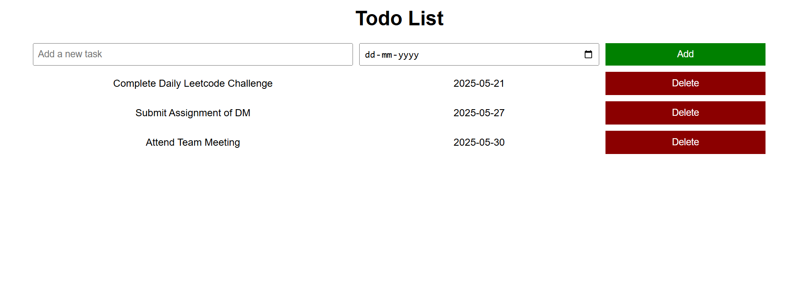

# 📝 To-Do List Web App

A simple and responsive To-Do List web application built using **HTML**, **CSS**, and **JavaScript**. This app allows users to add, view, and delete tasks. Tasks are saved in **localStorage**, so they persist even after refreshing the page. The layout is fully responsive for both **mobile** and **desktop** devices.


## 📌 Features

- ✅ Add new tasks with a due date
- 🗑️ Delete tasks
- 💾 Persistent storage using `localStorage`
- 📱 Mobile-first responsive design
- ⚡ Fast and lightweight


## 💻 Tech Stack

- HTML5
- CSS3 (Responsive using Flexbox/Grid)
- JavaScript (ES6)
- Browser `localStorage`

## 🚀 How to Use

#### **Clone the Repository**

```bash
git clone https://github.com/sandeep-m-patil/Todo-List.git
cd Todo-List
```

## Screenshot 




### Live Demo

[Link Text](URL)
